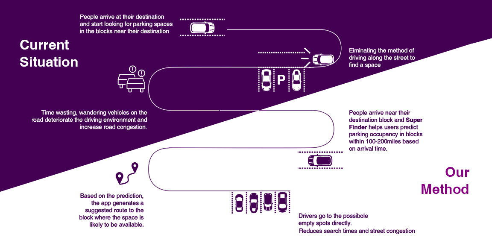
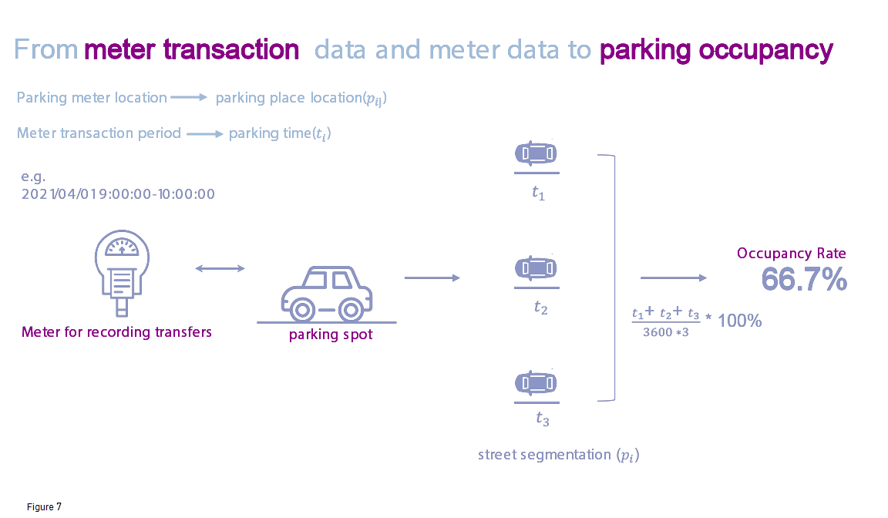

<style>
.list-group-item.active, .list-group-item.active:focus, .list-group-item.active:hover {
    background-color: #bdc9e1;
}

a:link {
  color: #8c96c6;
  background-color: transparent;
  text-decoration: none;
}

a:visited {
  color: #8c96c6;
  background-color: transparent;
  text-decoration: none;
}

a:hover {
  color: #88419d;
  background-color: transparent;
  text-decoration: underline;
}

a:active {
  color: #88419d;
  background-color: transparent;
  text-decoration: underline;
}

</style>

[**Youtube Link**](https://www.youtube.com/watch?v=PHoWrOwETd4)

```{r setup, include=FALSE}
knitr::opts_chunk$set(echo = TRUE)
```

```{r set_up, warning=FALSE, message=FALSE}
library(tidyverse)
library(dplyr)
library(sf)
library(lubridate)
library(tigris)
library(tidycensus)
library(viridis)
library(riem)
library(gridExtra)
library(knitr)
library(kableExtra)
library(RSocrata)
library(gifski)
library(gganimate)
library(FNN)
library(grid)
library(gridExtra)
library(stargazer)
library(hms)
library(osmdata)
library(gganimate)
library(caret)
library(RColorBrewer)
library(spdep)

st_c<-st_coordinates

p5 = viridis::viridis(5)
p2 = p5[c(4,3)]

p6 = c("#bfd3e6",
       "#9ebcda",
       "#8c96c6",
       "#8c6bb1",
       "#88419d",
       "#810f7c",
       "#4d004b")

plotTheme <- function(){theme(
  plot.title =element_text(size=12),
  plot.subtitle = element_text(size=8),
  plot.caption = element_text(size = 6),
  axis.text.x = element_text(size = 10,hjust = 1),
  axis.text.y = element_text(size = 10),
  axis.title.y = element_text(size = 10),
  # Set the entire chart region to blank
  panel.background=element_blank(),
  plot.background=element_blank(),
  #panel.border=element_rect(colour="#F0F0F0"),
  # Format the grid
  panel.grid.major=element_line(colour="#D0D0D0",size=.2),
  axis.ticks=element_blank())}

source("https://raw.githubusercontent.com/urbanSpatial/Public-Policy-Analytics-Landing/master/functions.r")
```

## I. Introduction

### 1.1 Motivation



In the U.S., the problems concerning parking are inveterate. One significant phenomenon caused by parking is **cruising**. Cruising can create negative externalities including congestion, air pollution and unnecessary fuel consumption (Fichman, 2016). For **individuals**, cruising for a public parking unit can waste precious time and money. All of these call for apps that can help people quickly find out the nearest vacant parking unit around their real time location. However, most of these applications are based on real-time database retrieval, which is greatly limited by the parking facility information covered by the data set and the statistical methods of facilities, making it difficult to provide users with accurate and effective real-time vacant parking information. Therefore, sometimes the users cannot locate the parking unit quickly and correctly, and will start a new round of depressing cruising.

Our APP ***Super Finder*** can help with such problems. ***Super Finder*** is a **real-time interactive** parking unit-searching mobile phone application, which operates in the city of San Francisco only, due to the availability of data. The team trained an OLS model on the **3-month (April to June 2021)** parking data in San Francisco and offered **street segment-based** prediction of a reasonable occupancy for the public street parking units. The APP’s target users are **individual drivers** in San Francisco in the **workday daytime (9am-6pm)**, no matter if they are office workers who want to park economically during the working hours or housewives looking for a temporary public parking unit for their cars on the street while heading to supermarkets or banks. Considering the relatively good generalizability of the model, we believe this approach can provide them with a safe estimate of what street segment to park on.

### 1.2 Use Case & Method

Basic information of ***Super Finder***:

* ***Super Finder***:a San Francisco based **real-time interactive** parking unit-searching mobile phone application.

* **Goal**: offer **street segment-based** prediction of a reasonable occupancy for the **public street parking units**.

* **Target user**: individual drivers in San Francisco.

* **Working Time**: Workday daytime(9am-6pm).

The method of the constructing the model generally consists of the following parts:

* Data Import & Wrangling

* Feature Engineering for the model

* Model Building for the occupancy

* Model Evaluation

The model can provide an estimate of hourly parking time for each street segment, and then the occupancy can be generated from the raw estimate. We build the model on a large number of street segments in San Francisco, if the accuracy and the generalizability are both satisfying, we suggest the model can be applied to other cities in the future.

## II. Data  Import

### 2.1 Parking Meters

[**Parking Meters**](https://data.sfgov.org/Transportation/Parking-Meters/8vzz-qzz9) is a summary of Location, cap color and other key attributes of parking meters in San Francisco. As for our use case, our selection for the meters are:

* Meters of general use 

* Meters for just one car parking, aka Simple space

* Meters that are *Active* *

The process of selection for *Active* * meters is not as simple as presented above. As the raw data that SFMTA provides has many indications for the status of the meters, besides “M” (active) & “T” (inactive), there are “U” &” L” without any captions. Out of accuracy concern, at the beginning we only discarded meters marked as T(inactive) and checked the filtered-out meters with the transaction records. We found that there are four meters marked as “U” but had 261 transaction records in Quarter 2, 2021. Still, we are not sure whether there are other meters that are active in fact but not  marked as “M” and did not have a single transaction record in the study time period, in the end, we only selected the meters marked as “M” and the four “U” that had transaction records as the **Active Meters**.

```{r read_parking_meters, warning=FALSE,message=FALSE}
# 所有的meters数据：
parking_meters<-st_read("C:/Users/yyp/Desktop/Upenn/MUSA/courses/MUSA5080/Final/data/Parking_Meters.geojson",quiet = TRUE)

# 先筛出Grey,SS,以及不是T的部分：
meters1<-parking_meters %>% 
  filter(active_meter_flag!="T") %>% 
  filter(cap_color == "Grey") %>% 
  filter(meter_type == "SS") %>% 
  dplyr::distinct()

# 读取最终有效的valid_id
valid<-read.csv("C:/Users/yyp/Desktop/Upenn/MUSA/courses/MUSA5080/Final/data/1202_valid.csv")

# 选出valid_id那一列
c<-valid$post_id

# meters2是最终选用的meter集合
meters1<-meters1 %>% 
  mutate(valid = ifelse(post_id %in% c,"TRUE","FALSE"))

meters2<-meters1 %>% 
  filter(valid=="TRUE") %>% 
  st_as_sf(.,coords = c("longitude","latitude"),crs=4326) 

meter_inactive = setdiff(unique(meters1$post_id),unique(meters2$post_id)) %>% length()
meter_active = intersect(unique(meters1$post_id),unique(meters2$post_id)) %>% length()

data.frame("meter_inactive"=meter_inactive,
           "meter_active"=meter_active)%>%
  gather()%>%
  ggplot(aes(key,value))+
    geom_col(fill=c("#440154FF","#bdc9e1"))+
    labs(title="Meter Activeness, SF, 2021.4-6",
         subtitle = 'Inactive: meters that are not in Transaction Dataset',
         x="", y ="Count",caption = "Figure 2.1")+
  theme(
  plot.title =element_text(size=12),
  plot.subtitle = element_text(size=8),
  plot.caption = element_text(size = 6),
  axis.text.x = element_text(size = 10,hjust = 1),
  axis.text.y = element_text(size = 10),
  axis.title.y = element_text(size = 10),
  # Set the entire chart region to blank
  panel.background=element_blank(),
  plot.background=element_blank(),
  #panel.border=element_rect(colour="#F0F0F0"),
  # Format the grid
  panel.grid.major=element_line(colour="#D0D0D0",size=.2),
  axis.ticks=element_blank())
```

### 2.2 San Francisco Geography Information

```{r SF,warning=FALSE,message=FALSE}
# 旧金山的地理信息
SF<-st_read("C:/Users/yyp/Desktop/Upenn/MUSA/courses/MUSA5080/Final/data/SF.shp",quiet = TRUE) %>% 
  st_transform(crs=4326)

ggplot()+
  geom_sf(data=SF,fill="grey90",color="white")+
  geom_sf(data=meters2,color=p5[1],size=1.2,alpha=0.1)+
  labs(title="Scatter Plot of Active Meters",
         subtitle = "San Francisco, April-June, 2021",
       caption = "Figure 2.2")+
  theme_minimal()+
  theme(axis.title = element_blank(),
        axis.text = element_blank(),
        axis.line=element_blank(),
        axis.text.x=element_blank(),
        axis.text.y=element_blank(),
        axis.ticks=element_blank(),
        axis.title.x=element_blank(),
        axis.title.y=element_blank(),
        panel.background=element_blank(),
        panel.border=element_blank(),
        panel.grid.major=element_line(colour = 'transparent'),
        panel.grid.minor=element_blank())
```

### 2.3 On-Street Parking Census

[**On-Street Parking Census**](https://data.sfgov.org/Transportation/On-Street-Parking-Census/9ivs-nf5y) contains information of street segments in San Francisco. We will aggregate the meters to the street segments for further analysis.

```{r On_Street_Parking_Census,warning=FALSE,message=FALSE}
# 读取街道的geometry
park_census<-st_read("C:/Users/yyp/Desktop/Upenn/MUSA/courses/MUSA5080/Final/data/On_Street_Parking_Census.geojson",quiet = TRUE)

# 仅选出街道id和geometry
street_geometry<-park_census %>% 
  mutate(cnn = cnn %>% as.numeric()) %>% 
  dplyr::select(cnn,geometry) %>% 
  st_sf() %>% 
  mutate(cnn = cnn %>% as.numeric() %>% as.character())

# 调色盘
pal<-colorRampPalette(p6[2:6])
pal_2<-pal(90)
```

### 2.4 Park Time Panel

Park time panel is generated by [**Parking Meter Detailed Revenue Transactions**](https://data.sfgov.org/Transportation/SFMTA-Parking-Meter-Detailed-Revenue-Transactions/imvp-dq3v). This dataset contains parking meter transaction records where each row equals a single transaction by a single customer at a single meter. 

As these records are just of the transactions, the accurate parking start time and end time are still unknown, we **assumed** that customers would park as long as the time period that they purchased in order to maximize the economic benefits, though it may seem a little bit unrealistic.

We selected the transactions records between **2021.4.1** and **2021.6.30** for analysis. Since the target use time is the workday daytime(9am-6pm), we conducted the following data wrangling:

* **Adjust the start & end time**:

Since our APP only offers predictions on workday daytime(9am-6pm), understanding the parking demand/occupancy rate between 9am and 6pm is just enough. Therefore, we should make some adjustments to the transaction records to meet our requirement.

If the start time of a record is earlier than 9am or the end time is earlier than 9am, we adjust the time as 9am;

If the start time of a record is later than 6pm or the end time is later than 6pm, we adjust the time as 6pm.

* **Check and filter out records that had start time and end not on the same day**:

According to [**SFMTA**](https://www.sfmta.com/getting-around/drive-park/parking-meters), most meters in San Francisco have a two-hour time limit, and approximately 25% of meters have a four hour time limit. Therefore, we first checked the transactions that did not start and end on the same day, and calculated the duration time of the records. If the duration exceeds the time limit, the record may be problematic, and we would filter them out. Luckily, there were just three records of this kind and they were filtered out.


* **Clean the overlaps**:

Some of the meters had time overlapping transaction records. The cause of such phenomenon is unknown, based on our maximizing-benefit assumption mentioned before, we combined the overlapping transaction records, and calculated the total duration time of the processed records.

```{r clean_overlap,warning=FALSE,message=FALSE,eval=FALSE}
# Combine overlaps

def join_times(x):
    startdf = pd.DataFrame({'time':x["session_start_dt"], 'what':1})
    enddf = pd.DataFrame({'time':x['session_end_dt'], 'what':-1})
    mergdf = pd.concat([startdf, enddf]).sort_values('time')
    mergdf['running'] = mergdf['what'].cumsum()
    mergdf['newwin'] = mergdf['running'].eq(1) & mergdf['what'].eq(1)
    mergdf['group'] = mergdf['newwin'].cumsum()
    x['group'] = mergdf['group'].loc[mergdf['what'].eq(1)]
    res = x.groupby('group').agg({'session_start_dt':'first','session_end_dt':'last' })
    res["interval"] = (res['session_end_dt']-res['session_start_dt']).dt.seconds
    return res
```

* **Split the duration time into intervals**:

We decided to analyze the parking time **on an hourly basis**, as an hour’s interval is a relatively appropriate time slot. If the interval is too long, for example, like 2-3 hours, some parking time pattern characteristics might be veiled. While a shorter time interval (like 15 minutes) is absolutely more welcomed, however, due to the amount of the records, and the restriction of the computing ability of our laptops, we had no alternative but quitted the idea.

```{r split_interval,warning=FALSE,message=FALSE,eval=FALSE}
# Split the duration time into intervals

#for rowNumber in range(2878234):
# void_panel是一个空panel.

def duration2(rowNumber):
    start_time_rounded = res.loc[rowNumber, "interval60"]
    start_time = res.loc[rowNumber, "session_start_dt"]
    end_time = res.loc[rowNumber, "session_end_dt"]
    post_id_row = res.loc[rowNumber, "post_id"]
    
    while start_time<end_time:
        s = start_time + onehour - (start_time.minute*onemin+start_time.second*onesec)
        
        if(end_time>s):
            this_end=s
        else:
            this_end=end_time
            
        this_interval = (this_end-start_time).total_seconds()
        p0 = void_panel.loc[(post_id_row,start_time_rounded),"duration"]
        void_panel.loc[(post_id_row,start_time_rounded),"duration"] = p0 + this_interval
        start_time_rounded += onehour
        start_time = this_end
    
    if rowNumber%1000==0:
    print(rowNumber)
```

* **Aggregate the splitted time records to the street segments**:

As our prediction is street segment-based, so after the splitting process, we aggregated the splitted time records (duration) to the street segments and added them up on an hourly basis.

The whole process was achieved with the help of python. Completing the five steps, we acquired the rudimentary park time panel. In later analysis, we would engineer and add more features to the panel.

```{r park_time_panel,warning=FALSE,message=FALSE}
# 读取处理好的panel,点数据
park_time_panel<-read.csv("C:/Users/yyp/Desktop/Upenn/MUSA/courses/MUSA5080/Final/data/park_time_panel.csv")

# 建立坐标系
park_time_panel<-park_time_panel %>% 
  st_as_sf(.,coords = c("longitude","latitude"),crs=4326) 

# 筛train/test
park_time_panel<-park_time_panel %>% 
  mutate(status = ifelse(Month=="6","test","train"))

# 地理信息
geo_info<-meters2 %>% 
  dplyr::select(post_id,geometry) %>% 
  dplyr::distinct()
```

### 2.5 Lag Park Time

San Francisco has a dynamic parking fare charging scheme, and from the SFMTA, we can see that generally the one street segment shares the same scheme. We can suspect that the meters in the same street segment have similar occupancy. The adjacent street segments should have approximate occupancy as well, because if the parking units in a street segment are fully occupied, the driver would start cruising and look for vacant ones in the adjacent street segments. Considering this neighborhood effect, we engineered a new feature called `lag_park_time` that calculated the occupied time of the three nearest meters for each meter. When aggregated to the street segments, we use the mean time of the feature of the meters as the lag duration time of the street segment.

```{r lag_park_time,warning=FALSE,message=FALSE}
# lag duration
coords<-st_coordinates(meters2)
neighborList <- knn2nb(knearneigh(coords, 3))
spatialWeights <- nb2listw(neighborList, style="W")

# 包含lag duration的time panel
panel2<-park_time_panel %>% 
  group_by(interval60) %>% 
  mutate(lag.duration = lag.listw(spatialWeights,duration))

# 按照街道，interval60计算总街道的lag duration
lag.duration<-panel2 %>% 
  st_drop_geometry() %>% 
  group_by(street_seg_ctrln_id,interval60) %>% 
  summarise(sum_lag.duration = sum(lag.duration)) %>% 
  ungroup()

# 为了之后left join
lag.duration<-lag.duration %>% 
  mutate(street_seg_ctrln_id = street_seg_ctrln_id %>% as.numeric() %>% as.character())
```

### 2.6 Weather Data

The weather indicators like temperature, wind and precipitation by hour and day are also considered. Following figures depict the trend of the indicators from **2021.4.1** to **2021.6.30**, and the precipitation indicator is excluded, as there is almost no change during the 3 months.

```{r weather, warning=FALSE, message=FALSE}
# 读取天气数据
Weather <- 
  riem_measures(station = "SFO", date_start = "2021-04-01", date_end = "2021-07-01") %>%
  dplyr::select(valid, tmpf, p01i, sknt)%>%
  replace(is.na(.), 0) %>%
    mutate(interval60 = ymd_h(substr(valid,1,13))) %>%
    mutate(week = week(interval60),
           dotw = wday(interval60, label=TRUE)) %>%
    group_by(interval60) %>%
    summarize(Temperature = max(tmpf),
              Precipitation = sum(p01i),
              Wind_Speed = max(sknt)) %>%
    mutate(Temperature = ifelse(Temperature == 0, 42, Temperature))

# 选取9-18点的数据
Weather1<-Weather %>% 
  filter(hour(interval60)>=9&hour(interval60)<=17)

# 作图
grid.arrange(
  ggplot(Weather, aes(interval60,Precipitation)) + geom_line(color="#8c96c6") + 
  labs(title="Percipitation", x="Hour", y="Precipitation") + plotTheme(),
  ggplot(Weather, aes(interval60,Wind_Speed)) + geom_line(color="#8c96c6") + 
    labs(title="Wind Speed", x="Hour", y="Wind Speed") + plotTheme(),
  ggplot(Weather, aes(interval60,Temperature)) + geom_line(color="#8c96c6") + 
    labs(title="Temperature", x="Hour", y="Temperature") + plotTheme(),
  top="Weather Data, San Francisco, April-June, 2021")
```

### 2.7 Amenity Data

* San Francisco Open Data: [**Muni Stops**](https://data.sfgov.org/Transportation/Muni-Stops/i28k-bkz6)

This dataset contains all transit stops in San Francisco.

```{r transit,warning=FALSE,message=FALSE}
# 读取transit数据
transit <- st_read("C:/Users/yyp/Desktop/Upenn/MUSA/courses/MUSA5080/Final/data/Muni Stops.geojson",quiet = TRUE)%>% 
  dplyr::select(geometry) %>% 
  st_transform(crs=4326) %>% 
  na.omit() %>% 
  distinct()

# 仅选取部分数据
meters3<-meters2 %>% 
  dplyr::select(post_id,street_seg_ctrln_id,geometry) %>% 
  dplyr::distinct()

# 计算transit.nn, 每个meter的
meters4<-meters3 %>% 
  mutate(
    transit.nn =
      nn_function(st_c(meters3), st_c(transit),1))
```

* Open Street Map data:

Restaurant/Theatre/Cafe/Hospital in San Francisco.

For each of the amenity features, we first calculated the mean of 3 nearest distances (`knn`) from one meter to the feature. For aggregation, as before, we selected the mean `knn` of meters in the whole street segments as the final feature.

```{r OSM,warning=FALSE,message=FALSE}
sf_boundary <- st_union(SF)

q0 <- osmdata::opq(bbox = c(-122.3505,37.7025,-122.5171,37.8364))

restaurant <- add_osm_feature(opq = q0, key = 'amenity', value = "restaurant") %>%
  osmdata_sf(.)
restaurant.sf <- st_geometry(restaurant$osm_points) %>%
  st_transform(4326) %>%
  st_sf() %>%
  cbind(., restaurant$osm_points$amenity) %>%
  rename(NAME = restaurant.osm_points.amenity)%>%
  st_transform(crs=4326)%>%
  st_intersection(sf_boundary)%>%
  dplyr::select(geometry)%>%
  distinct()

theatre <- add_osm_feature(opq = q0, key = 'amenity', value = "theatre") %>%
  osmdata_sf(.)
theatre.sf <- st_geometry(theatre$osm_points) %>%
  st_transform(4326) %>%
  st_sf() %>%
  cbind(., theatre$osm_points$amenity) %>%
  rename(NAME = theatre.osm_points.amenity)%>%
  st_transform(crs=4326)%>%
  st_intersection(sf_boundary)%>%
  dplyr::select(geometry)%>%
  distinct()

cafe <- add_osm_feature(opq = q0, key = 'amenity', value = "cafe") %>%
  osmdata_sf(.)
cafe.sf <- st_geometry(cafe$osm_points) %>%
  st_transform(4326) %>%
  st_sf() %>%
  cbind(., cafe$osm_points$amenity) %>%
  rename(NAME = cafe.osm_points.amenity)%>%
  st_transform(crs=4326)%>%
  st_intersection(sf_boundary)%>%
  dplyr::select(geometry)%>%
  distinct()

clothes <- add_osm_feature(opq = q0, key = 'shop', value = "clothes") %>%
  osmdata_sf(.)
clothes.sf <- st_geometry(clothes$osm_points) %>%
  st_transform(4326) %>%
  st_sf() %>%
  cbind(., clothes$osm_points$shop) %>%
  rename(NAME = clothes.osm_points.shop)%>%
  st_transform(crs=4326)%>%
  st_intersection(sf_boundary)%>%
  dplyr::select(geometry)%>%
  distinct()

hospital <- add_osm_feature(opq = q0, key = 'amenity', value = "hospital") %>%
  osmdata_sf(.)
hospital.sf <- st_geometry(hospital$osm_points) %>%
  st_transform(4326) %>%
  st_sf() %>%
  cbind(., hospital$osm_points$amenity) %>%
  rename(NAME = hospital.osm_points.amenity)%>%
  st_transform(crs=4326)%>%
  st_intersection(sf_boundary)%>%
  dplyr::select(geometry)%>%
  distinct()
```

### 2.8 Lag time & Join

* Generate lag time features

* Join all

```{r lag_time_and_join,warning=FALSE,message=FALSE}
panel.summary<-park_time_panel %>% 
  st_drop_geometry() %>% 
  dplyr::select(post_id,interval60,duration,date,street_seg_ctrln_id,count_valid) %>% 
  group_by(street_seg_ctrln_id,interval60,count_valid) %>% 
  summarise(sum_duration = sum(duration)) %>% 
  distinct() %>% 
  ungroup() %>% 
  mutate(avg_duration = sum_duration/count_valid)

# time lag
panel.summary<-panel.summary %>% 
  group_by(street_seg_ctrln_id) %>% 
  mutate(lagHour = dplyr::lag(sum_duration,1),
         lag2Hours = dplyr::lag(sum_duration,2),
         lag3Hours = dplyr::lag(sum_duration,3),
         lag1day = dplyr::lag(sum_duration,9),
         lagWeek = dplyr::lag(sum_duration,9*7),
         weekday = interval60%>%wday(T),
         hour = interval60%>%hour()) %>% 
  ungroup()

# knn for amenities
meters4<-meters4 %>% 
  mutate(
    restaurant.nn = 
      nn_function(st_c(meters4),st_c(restaurant.sf),3),
    theatre.nn = 
      nn_function(st_c(meters4),st_c(theatre.sf),3),
    cafe.nn = 
      nn_function(st_c(meters4),st_c(cafe.sf),3),
    clothes.nn = 
      nn_function(st_c(meters4),st_c(clothes.sf),3),
    hospital.nn = 
      nn_function(st_c(meters4),st_c(hospital.sf),3),
  )

# aggregate到街道上，用平均值进行替代
meters5<-meters4 %>% 
  st_drop_geometry() %>% 
  group_by(street_seg_ctrln_id) %>% 
  summarise(transit.nn = mean(transit.nn),
            restaurant.nn = mean(restaurant.nn),
            theatre.nn = mean(theatre.nn),
            cafe.nn = mean(cafe.nn),
            clothes.nn = mean(clothes.nn),
            hospital.nn = mean(hospital.nn)) %>% 
  ungroup() %>% 
  mutate(street_seg_ctrln_id = 
           street_seg_ctrln_id %>% 
           as.numeric() %>% 
           as.character())

# left_join
panel.summary<-panel.summary %>% 
  mutate(street_seg_ctrln_id = street_seg_ctrln_id %>% as.numeric() %>% as.character()) %>% 
  left_join(meters5) %>% 
  left_join(lag.duration) %>% 
  left_join(Weather1 %>% 
              mutate(interval60 = interval60 %>% as.character()),
            by="interval60")
```

## III. Exploratory Analysis

### 3.1 Temporal Process

```{r figure_3_1,warning=FALSE,message=FALSE}
# Train/Test Duration统计图

park_time_panel %>% 
  st_drop_geometry() %>% 
  group_by(date,status) %>% 
  summarise(time_sum = sum(duration)) %>% 
  ggplot(aes(ymd(date),time_sum,color=status))+
  scale_color_manual(values = c("#bdc9e1","#440154FF"))+
  geom_line()+
  labs(title = "Total Parking Time by Week",
       subtitle = "San Francisco, April-June, 2021",
       x = "Day",
       y = "Total Parking Time(Seconds)",
       caption = "Figure 3.1")+
  theme_minimal()+
  theme(panel.grid.major = element_blank())
```

Figure 3.1 is the total parking time by week, it clearly reveals a periodical pattern of total parking time. During the weekdays, from Monday to Friday, there is an upward trend of total parking time, generally, the parking time would reach the peak of the week on Friday. On Saturday, the parking time drops a little, while on Sundays, the parking time falls to the week’s bottom. This phenomenon can be explained by that in San Francisco, most meters would not work on Sundays.

```{r figure_3_2,warning=FALSE,message=FALSE}
# Histogram of Parking Time in Seconds, By Meter

park_time_panel %>% 
  ggplot(aes(duration))+
    geom_histogram(bins=30, fill = "#bdc9e1", color="white") +
    scale_y_log10()+
    labs(title="Histogram of Parking Time in Seconds, By Meter",
         subtitle = 'San Francisco, April-June, 2021', y='log(count)',
         caption = "Figure 3.2")+
  theme_minimal()+
  theme(panel.grid.major = element_blank())
```

Figure 3.2 presents the histogram of parking time by meters and every 60 mins’ interval from April to June 2021. We can see that duration at 0 second (not occupied in an hour) and 3600 seconds (fully occupied in an hour), both have a spike. While as for duration between 0 and 3600, the count of meters basically did not change. Also, the weird distribution gives the reason why we would not build the OLS model on a single parking meter.

```{r Figure_3_3,warning=FALSE,message=FALSE}
# Histogram of Total Parking Time by Street Block

park_time_panel %>% 
  st_drop_geometry() %>% 
  group_by(street_seg_ctrln_id,Month) %>% 
  summarise(time_sum = sum(duration)) %>% 
  ggplot(aes(time_sum))+
  geom_histogram(bins=50, fill = "#bdc9e1",color="white")+
  #facet_wrap(~Month)+
  labs(title = "Total Parking Time by Street Segments",
       subtitle = "San Francisco, April-June, 2021",
       x = "Total Parking Time(Seconds)",
       y = "Count",
       caption = "Figure 3.3")+
  theme_minimal()+
  theme(panel.grid.major = element_blank())
```

Then we aggregated the total parking time of meters to the street segments where the meters belong to. Figure 3.3 shows the total parking time by street segments. There is a left-skewed distribution in the picture, and it is a sign that we can try building an OLS model on the street segments to predict the parking time, perhaps a log transformation should be applied before modeling.

```{r figure_3_4,warning=FALSE,message=FALSE}
# Plot:Mean Parking Time Per Street Segment

seg_panel<-park_time_panel %>% 
            st_drop_geometry() %>% 
            dplyr::select(post_id,interval60,duration,street_seg_ctrln_id) %>% 
            mutate(time_of_day =
                     case_when(
                   hour(interval60)>=9&hour(interval60)<12~"9AM-12PM",
                   hour(interval60)>=12&hour(interval60)<15~"12PM-3PM",
                   hour(interval60)>=15&hour(interval60)<=18~"3PM-6PM")) %>% 
            mutate(time_of_day=fct_relevel(time_of_day,"9AM-12PM","12PM-3PM","3PM-6PM")) %>% 
            group_by(post_id,street_seg_ctrln_id,time_of_day) %>% 
            summarise(sum_time=sum(duration)) %>% 
            ungroup() %>% 
            group_by(street_seg_ctrln_id,time_of_day) %>% 
            summarise(mean_time = mean(sum_time))

ggplot(seg_panel)+
  geom_histogram(aes(mean_time),bins = 20, fill="#bdc9e1",color="white")+
  labs(title="Mean Parking Time Per Street Segment",
       subtitle="San Francisco, April-June, 2021",
       x="Mean Parking Time", 
       y="Frequency",
       caption = "Figure 3.4")+
  facet_wrap(~time_of_day)+
    theme_minimal()+
  theme(panel.grid.major = element_blank())
```

This is another evidence that supported the idea of building an OLS on the street segments. In Figure 3.4, we evenly divided the 9 hours into 3 categories: 9am-12pm, 12pm-3pm, 3pm-6pm. We can see that the distribution of the parking time in each category generally fits a normal distribution, which meets the requirement of building an OLS model. So far, we are sure that the building method would be OLS, and the dependent variable is each street segment’s total parking time in an hour’s interval from 9am to 6pm.

```{r figure_3_5,warning=FALSE,message=FALSE}
plotData_lag <-
  as.data.frame(panel.summary)%>%
  dplyr::select(starts_with("lag"), sum_duration) %>% 
  gather(Variable, Value, -sum_duration) %>%
  mutate(Variable = fct_relevel(Variable, "lagHour","lag2Hours","lag3Hours","lag1day","lagWeek"))

correlation_lag <-
  group_by(plotData_lag, Variable) %>%
  summarize(correlation = round(cor(Value, sum_duration, use = "complete.obs"), 2))

plotData_lag%>%sample_n(100000)%>%
ggplot(aes(Value, sum_duration)) +
  geom_point(size = 0.1,color="#bdc9e1",alpha=0.3) +
  geom_text(data = correlation_lag, 
            aes(label = paste("r =", round(correlation, 2))),
            x=-Inf, y=Inf, vjust = 1.5, hjust = -.1,size=3) +
  geom_smooth(method = "lm", se = FALSE, colour = "#440154FF",size=0.8) +
  facet_wrap(~Variable, nrow = 2, scales = "free") +
  labs(title = "")+
   theme(axis.line=element_blank(),
        axis.ticks=element_blank(),
        panel.background=element_blank(),
        panel.border=element_blank(),
        panel.grid.major=element_line(colour="#D0D0D0",size=.2),)
```

Given the strong periodical pattern of the total parking time that we observed in the above figures, it is necessary to engineer some time lag features. Here are the 5 time lags. Then we checked the correlation between the parking time and the time lag features. What has shown in Figure 3.5 confirmed the strong correlation existed (as 4 of the 5 time lags has r around 0.8 or exceeds 0.8), and we would add the time lag features in the model.

### 3.2 Spacial Process

```{r figure_3_6,warning=FALSE,message=FALSE}
# Plot:星期几的平均值
pal<-colorRampPalette(p6)
pal_1<-pal(90)

sum_park_time_panel<-park_time_panel %>% 
  st_drop_geometry() %>% 
  dplyr::select(post_id,interval60,duration,date,day_of_week,street_seg_ctrln_id,count_valid) %>% 
  group_by(post_id,date,day_of_week) %>% 
  summarise(sum_duration = sum(duration)) %>% 
  distinct() %>% 
  ungroup() %>% 
  group_by(post_id,day_of_week) %>% 
  summarise(mean_duration = mean(sum_duration))

ggplot()+
  geom_sf(data=SF,fill="transparent",color="#bdc9e1")+
  geom_sf(data=sum_park_time_panel %>%
            mutate(day_of_week=fct_relevel
                   (day_of_week,"Monday","Tuesday",
                     "Wednesday","Thursday","Friday",
                     "Saturday","Sunday")) %>% 
            filter(day_of_week!="Sunday") %>% 
            left_join(geo_info) %>% 
            st_sf(),
          aes(color=mean_duration),alpha=0.1,size=0.5)+
  scale_color_gradientn(colors=pal_1)+
  labs(title="Mean Parking Time of Each Meters by Day",
       subtitle = "San Francisco, April-June, 2021",
       caption = "Figure 3.6")+
  facet_wrap(~day_of_week,nrow=2)+
  theme(axis.title = element_blank(),
        axis.text = element_blank(),
        axis.line=element_blank(),
        axis.text.x=element_blank(),
        axis.text.y=element_blank(),
        axis.ticks=element_blank(),
        axis.title.x=element_blank(),
        axis.title.y=element_blank(),
        legend.direction = "horizontal",
        legend.key.height = unit(0.2, "cm"), 
        legend.key.width = unit(1, "cm"),
        panel.background=element_blank(),
        panel.border=element_blank(),
        panel.grid.major=element_line(colour = 'transparent'),
        panel.grid.minor=element_blank())+
  theme(legend.position = "bottom")
```

Figure 3.6 is the mean duration of the meters each weekday and Saturday. Obviously, there is a spatial pattern, as the meters with higher mean duration time are mainly clustered in the Northeast quarter of San Francisco and the ports. Also, from Monday to Saturday, the scatter plot exhibits a stable distribution. Based on the two observations, we should add geographical predictors to our model.

```{r figure_3_7,warning=FALSE,message=FALSE,eval=FALSE}
panel.summary%>%
  pivot_longer(cols=ends_with(".nn"),names_to="name1",values_to="value_raw")%>%
  mutate(value_logged = log(value_raw))%>%
  pivot_longer(cols=starts_with("value"),names_to="if_log",values_to="name_log")%>%
  mutate(across(if_log, factor, levels=c("value_raw","value_logged"))) %>%
  ggplot()+
    geom_histogram(aes(name_log,fill=name1),bins=30,color="transparent")+
    scale_fill_manual(values=p6,guide=F)+
    facet_wrap(if_log~name1,scales = "free",nrow=2)+
    labs(title='Distribution of Nearest Neighbor Variables',
         subtitle = 'San Francisco, April-June, 2021', x="",
         caption = "Figure 3.7")+
  theme_minimal()
```


`knn` feature is a type of good geographical predictors. In this study, it can depict the relation between the meters and the amenities around. We selected 6 amenity features and checked their distribution. Generally, all of the `knn` features generated on the amenities had a left-skewed distribution, then we applied log-transformation. On the second row, we can see that the logged features have normal distribution, which meet the requirement of building an OLS prediction model.

```{r figure_3_8,warning=FALSE,message=FALSE}
# log transformation
panel.summary<-panel.summary %>% 
  mutate_at(ends_with(".nn")%>%vars()%>%all_of(),log)

plotData.lag <-
  as.data.frame(panel.summary)%>%
  dplyr::select(ends_with("nn"), sum_duration) %>%
  gather(Variable, Value, -sum_duration)

correlation.lag <-
  group_by(plotData.lag, Variable) %>%
  summarize(correlation = round(cor(Value, sum_duration, use = "complete.obs"), 2))

plotData.lag%>%sample_n(100000)%>%
ggplot(aes(Value, sum_duration)) +
  geom_point(size = 0.3, shape=16, stroke=0.4,color="#bdc9e1",alpha=0.3) +
  geom_text(data = correlation.lag, 
            aes(label = paste("r =", round(correlation, 2))),
            x=-Inf, y=Inf, vjust = 1.5, hjust = -.1,size=3) +
  geom_smooth(method = "lm", se = FALSE, colour = "#440154FF") +
  facet_wrap(~Variable, nrow = 2, scales = "free") +
  labs(title = "",caption = "Figure 3.8") +
  theme(axis.line=element_blank(),
        axis.ticks=element_blank(),
        panel.background=element_blank(),
        panel.border=element_blank(),
        panel.grid.major=element_line(colour="#D0D0D0",size=.2),)
```

Then we checked the correlation between the logged `knn` features and the parking time of the street segment. The correlation of all the 6 logged `knn` features and the parking time is not strong. Perhaps, it has something to do with the method we applied to add the `knn` features to the street segments: we calculated the mean `knn` value of all the meters in a specific street segment, and then used the mean as the predictors. Such predictors could have different distributions from those in Figure 3.7. However, we still keep the `knn` features, and would be added to the model later in order to contrast with the baseline model.

## IV. Modeling

### 4.1 Model Building

According to the exploratory analysis in part.III, we decided to build an OLS model on the dependent variable: ***The sum of parking time(unit: second) in each hour interval from 9am to 6pm, every street segment***.

#### 4.1.1 Splitting Train/Test Set

In this study, we selected the records in April and May as the train set, records in June as the test set.

```{r Train_Test,warning=FALSE,message=FALSE,results='asis'}
## 如果4.2运行有问题请运行此段代码，重新跑4.1和4.2
#panel.summary<-read.csv("C:/Users/yyp/Desktop/Upenn/MUSA/courses/MUSA5080/Final/park_time_panel.sum2.csv")

# Train(67%)/Test Split(33%)

park_train<-panel.summary %>% 
  filter(month(interval60)!=6)

park_test<-panel.summary %>% 
  filter(month(interval60)==6)
```

#### 4.1.2 Feature Selection

So far, in the final park time panel we have the following types of features:

* **Number of valid meters in each street segment**: `count_valid`

* **Weather Features**: `Temperature`+`Wind_Speed`

* **Time Dummy**: `weekday`+`hour`

* **Lag Time Features**: `lagHour`+`lag2Hours`+`lag3Hours`+`lag1day`+`lagWeek`

* **Amenity Features**:  `transit.nn`+`restaurant.nn`+`cafe.nn`+`theatre.nn`+`clothes.nn`+`hospital.nn`

* **Parking Neighborhood Effects Feature**: `sum_lag.duration`

Based on the features, we build the following five OLS models:

* **Model.1**`weather_time_model`: `count_valid`+**Weather Features**+**Time Dummy**

* **Model.2**`weather_time_space_model`:**Model.1**+**Amenity Features**

* **Model.3**`weather_time_lag_model`:**Model.1**+**Lag Time Features**

* **Model.4**`weather_time_lag_space_model`:**Model.2**+**Lag Time Features**

* **Model.5**`lag_duration_model`:**Model.4**+**Parking Neighborhood Effects Feature**

```{r feature_selection,warning=FALSE,message=FALSE}
# Model1. weather_time_model
formula1 = sum_duration ~ count_valid + Temperature+Wind_Speed+weekday+hour

# Model2. weather_time_space_model
formula2 = sum_duration ~  count_valid + Temperature+Wind_Speed +transit.nn +restaurant.nn+cafe.nn+theatre.nn+clothes.nn+hospital.nn+weekday+hour

# Model3. weather_time_lag_model
formula3 = sum_duration ~  count_valid + lagHour + lag2Hours+lag3Hours+lag1day+lagWeek+Temperature+Wind_Speed+weekday+hour

# Model4. weather_time_lag_space_model
formula4 = sum_duration ~  count_valid + lagHour + lag2Hours+lag3Hours+lag1day+lagWeek+weekday+hour+transit.nn +restaurant.nn+cafe.nn+theatre.nn+clothes.nn+hospital.nn+Temperature+Wind_Speed

# Model5. weather_time_lag_space_model
formula5 = sum_duration ~  count_valid + lagHour + lag2Hours+lag3Hours+lag1day+lagWeek+sum_lag.duration+weekday+hour+transit.nn +restaurant.nn+cafe.nn+theatre.nn+clothes.nn+hospital.nn+Temperature+Wind_Speed

reg1 <- lm(formula1, data=park_train)
reg2 <- lm(formula2, data=park_train)
reg3 <- lm(formula3, data=park_train)
reg4 <- lm(formula4, data=park_train)
reg5 <- lm(formula5, data=park_train)
```

### 4.2 Prediction

```{r html,warning=FALSE,message=FALSE,results='asis'}
stargazer(reg1,reg2,reg3,reg4,reg5,type = "html", 
          title = "",
          header = FALSE,
          single.row = TRUE,
          notes.align = "c",
          out="model.html")
```

From the results, we can see that after adding lag time features to our OLS model, the R-squared improved significantly, from 0.45 to 0.89. That is to say, about 89% of the variance in the dependent variable (***the sum of parking time(unit: second) in each hour interval from 9am to 6pm, every street segment***), is explained by the OLS model.

```{r figure_4_1,warning=FALSE,message=FALSE}
model_pred <- function(dat, fit){
   pred <- predict(fit, newdata = dat)}

park_test1<-park_test %>% 
  mutate(Month = month(interval60))

park_test_Nest <- 
  as.data.frame(park_test1) %>%
  nest(-Month)

#install.packages("dplyr")

predictions <- 
  park_test_Nest %>% 
    mutate(weather_time_model = map(.x = data, fit = reg1, .f = model_pred),
           weather_time_space_model = map(.x = data, fit = reg2, .f = model_pred),
           weather_time_lag_model = map(.x = data, fit = reg3, .f = model_pred),
           weather_time_lag_space_model = map(.x = data, fit = reg4, .f = model_pred),
           lag_duration_model = map(.x = data, fit = reg5, .f = model_pred))

mean.na = function(x) {mean(x,na.rm=T)}
sd.na = function(x) {sd(x,na.rm=T)}

predictions <- predictions %>%  
    gather(Regression, Prediction, -data, -Month) %>% 
    mutate(Observed = map(data, pull, sum_duration),
           Absolute_Error = map2(Observed, Prediction,  ~ abs(.x - .y)),
           MAE = map_dbl(Absolute_Error, mean.na),
           sd_AE = map_dbl(Absolute_Error, sd.na),
           street_id = map(data, pull, street_seg_ctrln_id))

predictions %>%
  dplyr::select(Month, Regression, MAE) %>%
  gather(Variable, MAE, -Regression, -Month) %>%
  mutate(
    across(Regression,factor,levels=c("weather_time_model","weather_time_space_model","weather_time_lag_model","weather_time_lag_space_model","lag_duration_model"))
  )%>%
  ggplot(aes(Month%>%as.factor(), MAE)) + 
    geom_bar(aes(fill = Regression), position = "dodge", stat="identity") +
    scale_fill_manual(values = p6[2:6]) +
    labs(title = "Mean Absolute Errors by model specification",x="Month",caption = "Figure 4.1")
```

Figure 4.1 exhibits the MAE of the five models, as the R-squared has indicated, the time lag features greatly improved the accuracy of the prediction. Considering both R-squared and MAE, we selected the **Model.5** `lag_duration model` as our **final model**, for its best performance on the two indicators.

```{r figure_4_2,warning=FALSE,message=FALSE}
w1<-predictions %>% 
  mutate(interval60 = map(data, pull, interval60)) %>%
  dplyr::select(street_id,interval60, Observed, Prediction, Regression) %>%
  unnest() 

w2<-w1 %>% 
  group_by(Regression,interval60) %>% 
  summarise(Observed = sum(Observed),
            Prediction = sum(Prediction)) %>% 
  ungroup()

w3<-w2 %>% 
  gather(Variable,value,-Regression,-interval60) 

w3 %>% 
  mutate(Regression = fct_relevel(Regression,"weather_time_model","weather_time_space_model","weather_time_lag_model","weather_time_lag_space_model","lag_duration_model")) %>% 
  ggplot(aes(ymd_hms(interval60),value,color=Variable))+
  scale_color_manual(values = c(p6[3],p5[1]))+
  geom_line(size = 0.8)+
  facet_wrap(~Regression,ncol=1)+
  labs(title = "Predicted/Observed Parking Time by hourly interval", 
       subtitle = "San Francisco, 9am-6pm, June, 2021",
       x = "Date", y= "Parking Time") +
  theme_minimal()+
   theme(axis.line=element_blank(),
         axis.text.x=element_blank(),
         axis.text.y=element_blank(),
         axis.ticks=element_blank(),
         #axis.title.x=element_blank(),
         #axis.title.y=element_blank(),
         panel.background=element_rect(color = "grey90"),
         panel.border = element_blank(),
         panel.grid.major=element_line(colour = 'transparent'),
         panel.grid.minor=element_blank(),
         legend.position = "bottom") 

```

Figure 4.2 shows the added-up prediction of all the street segments every day in June, 2021. Models with time lag features fit the observance well, especially for the peak points. However, all of the 3 models cannot predict as accurately as they are when predicting on Sundays, the lowest points of a week. However, it does not matter as our APP ***Super Finder*** only focuses on Weekdays.

## V. Cross Validation

```{r CV,warning=FALSE,message=FALSE}
fitControl <- trainControl(method = "cv", number = 50,savePredictions=T)
set.seed(72)
reg.cv = train(formula5, data = panel.summary, 
     method = "lm", trControl = fitControl, na.action = na.pass)

reg.summary <-reg.cv$pred%>%
  dplyr::select(foldNum = Resample,pred,obs)%>%
  mutate(AE = abs(pred-obs),
         APE = abs(pred-obs)/obs)%>%
  group_by(foldNum)%>%
  summarise(MAE = mean(AE,na.rm=T),
            SD_MAE = sd(AE,na.rm=T))

reg.summary %>%
  pivot_longer(-foldNum)%>%
  ggplot(aes(value))+
  geom_histogram(colour="white", fill = "#bdc9e1")+
  facet_wrap(~name,scale='free')+
  labs(title="Distribution of MAE",
       subtitle = "50-fold cross-validation",
       caption = "Figure 5.1")+
  theme(axis.line=element_blank(),
        axis.ticks=element_blank(),
        panel.background=element_blank(),
        panel.border=element_blank(),
        panel.grid.major=element_line(colour="#D0D0D0",size=.2),)
```

The above is the 50-fold cross validation of our final OLS model, the lag duration model. We can see that the MAE and standard MAE clustered, which suggests a good generalizability of our final OLS model. In the left picture, we can see that the mean of MAE in the cross-validation is around 2830 seconds, which may seem a little large as there are only 3600 seconds in an hour.  While it is the value of MAE in every street segment, and the number of valid meters varies from different street segments. Therefore, we should adopt another way to evaluate the accuracy of our model, especially the number of valid meters should be considered, before applying it to our APP.

## VI. Additional Information

### 6.1 Occupancy Rate



Before approaching the problem put forward in the cross-validation, it is necessary to clarify the concept of ***Occupancy Rate***. In this study, Occupancy Rate refers to the percentage of time that the valid parking units in a specific street segment are occupied in a given time interval (the default value is an hour in this study), the denominator here is the valid parking unit number multiplied by the unit interval time. 

### 6.2 Street Segment-wise MAE per Valid Meter

#### 6.2.1 Average MAE of 9am to 6pm per Valid Meter

```{r figure_6_1,warning=FALSE,message=FALSE}
w6<-w1 %>% 
  filter(Regression == "lag_duration_model")

w7<-w6 %>% 
  group_by(street_id) %>% 
  summarise(Observed1 = sum(Observed),
            Prediction1 = sum(Prediction),
            MAE = mean(abs(Observed-Prediction))) %>% 
  ungroup() 

count_valid<-park_test %>% 
  dplyr::select(street_seg_ctrln_id,count_valid) %>% 
  dplyr::distinct() %>% 
  mutate(street_seg_ctrln_id = street_seg_ctrln_id %>% as.numeric() %>% as.character())

street_geometry<-street_geometry %>% 
  mutate(cnn = cnn %>% as.numeric() %>% as.character())

w8<-w7 %>% 
  mutate(street_id = street_id%>% as.numeric() %>% as.character()) %>% 
  left_join(count_valid,by=c("street_id"="street_seg_ctrln_id")) %>% 
  left_join(street_geometry,by = c("street_id"="cnn")) %>% 
  mutate(avg.MAE = MAE/(count_valid)) %>% 
  st_sf()

ggplot()+
  geom_sf(data=SF, fill="grey90",color="grey90")+
  geom_sf(data=w8,aes(color=avg.MAE),alpha = 1,size=1.4)+
  scale_color_gradientn(colors=pal_1,name = "MAE(seconds)")+
  labs(title="MAE per Valid Meter by Street Segment",
       subtitle = "Each hour, 9am-6pm, June, 2021",
       name = "MAE per meter")+
  theme(axis.title = element_blank(),
        axis.text = element_blank(),
        axis.line=element_blank(),
        axis.text.x=element_blank(),
        axis.text.y=element_blank(),
        axis.ticks=element_blank(),
        axis.title.x=element_blank(),
        axis.title.y=element_blank(),
        legend.direction = "horizontal",
        legend.key.height = unit(0.2, "cm"), 
        legend.key.width = unit(1, "cm"),
        panel.background=element_blank(),
        panel.border=element_blank(),
        panel.grid.major=element_line(colour = 'transparent'),
        panel.grid.minor=element_blank())+
  theme(legend.position = "bottom")
```

The above picture shows the method that we applied to solve the problem mentioned in Cross-validation. 

The indicator in the figure is obtained in this way:

* After getting the prediction of the model, **group** the test set **by street segments**, and calculate the MAE of **each** segment. Then we get the MAE for every street segment.

* This result is named as **street segment-wise MAE**.

* Divide each street segment-wise MAE by **the number of the street segment’s valid parking units**.

* Then we obtained  the indicator, which represents the average MAE for each valid parking unit in a specific street segment. It should be pointed out that such MAE is still an evaluation of one hour’s occupancy, in other words, we should compare it in **one hour’s** scale.

Obviously this indicator contains geographical information, while cross-validation is too general; it represents the MAE per valid meter in the street segment,  which reflects some ideas of how we calculate the occupancy rate in 6.1. All these characteristics suggest this indicator is more specific than cross-validation, and it should be better when evaluating our model.

As the picture has shown, quite a large portion of all the street segments has a relatively low average MAE per valid meter, generally the value of the indicator is around 300 seconds to 600 seconds, which equals 5 to 10 minutes. We believe this amount of error value is within an acceptable range,  and we guess many drivers would tolerate it if they are asked to wait 5 minutes until the car parked at the occupied drive away. 

Also, this picture suggested a relatively good generalizability, as the street segments with high value of this indication did not cluster, at least it scatters from visualization.

#### 6.2.2 Average MAE of each hour per Valid Meter

```{r figure_6_2,warning=FALSE,message=FALSE}
w9<-w6 %>% 
  mutate(hour9 = hour(interval60)) %>% 
  group_by(street_id,hour9) %>% 
  summarise(hour.MAE = mean(abs(Observed-Prediction)))%>% 
  ungroup() %>% 
  mutate(street_id = street_id%>% as.numeric() %>% as.character()) %>% 
  left_join(count_valid,by=c("street_id"="street_seg_ctrln_id")) %>% 
  left_join(street_geometry,by = c("street_id"="cnn")) %>% 
  mutate(avg.hour.MAE = hour.MAE/(count_valid)) %>% 
  st_sf()

ggplot()+
  geom_sf(data=SF, fill="grey90",color="grey90")+
  geom_sf(data=w9,aes(color=avg.hour.MAE),alpha = 1,size=0.8)+
  scale_color_gradientn(colors=pal_1,name = "MAE(seconds)")+
  labs(title="MAE per Valid Meter by Street Segment",
       subtitle = "9am-6pm, June, 2021",
       name = "MAE per meter",
       caption = "Figure 6.2")+
  facet_wrap(~hour9,nrow = 2)+
  theme_minimal()+
  theme(axis.title = element_blank(),
        axis.text = element_blank(),
        axis.line=element_blank(),
        axis.text.x=element_blank(),
        axis.text.y=element_blank(),
        axis.ticks=element_blank(),
        axis.title.x=element_blank(),
        axis.title.y=element_blank(),
        legend.direction = "horizontal",
        legend.key.height = unit(0.2, "cm"), 
        legend.key.width = unit(1, "cm"),
        panel.background=element_blank(),
        panel.border=element_blank(),
        panel.grid.major=element_line(colour = 'transparent'),
        panel.grid.minor=element_blank())+
  theme(legend.position = "bottom")
```

This is a step further from 6.2.1. We calculated the street segment-wise MAE per valid meter in each hour from 9am to 6pm, rather than a single MAE per valid meter for the whole 9 hours. The figure reveals the MAE transition from morning to the evening. As we can see, except from 9am to 10am, our model’s performance is steady. For most street segments, the MAE per valid meter is around 5-10 min, like that in 6.2.1. Thus, we can draw the conclusion that our model’s prediction ability is stable, and has a relatively good generalizability.

## VII. Discussion

### 7.1 Use Case Result

Generally speaking, our APP ***Super Finder*** is promising for that the R-squared value is 0.89, and it has also achieved good performance on both accuracy and generalizability. While in practice, individual drivers may care more about the occupancy rate of the specific street segments, since parking fare is closely related to the occupancy rate due to the dynamic charging scheme in San Francisco. If the occupancy rate in a street segment reaches 80%, then the charge would raise 0.25 dollars per hour. By some simple calculation, we can get the occupancy rate of the street segments. Our users can use our APP to quickly find out the nearest and cheapest vacant public parking units around their real-time location.


### 7.2 Improvements

* **Data Wrangling**

In the process of data cleaning, some data made us really confused. Take the meter types as an example, there are four kinds in total, but only two are captioned.  Another point is that if SFMTA could provide us with a more exact dataset, such as with the information when the parking starts and ends rather than that of the transaction records, the model might be more accurate, and the problem of overlapping would also not exist.

* **Predictor Variables**

1. **Improved geometry information**

Though we tried different types of features in our model, there are still many other features that can account for the parking occupancy rate in some way that are not included in this study. One is the econometric information in **ACS**. As our study unit is the street segments, the geometry of which is a line string. What hampered us from using the information is the ambiguous line string, and some of the line strings are just lying between two census tracts, then we cannot define where the line string belongs to, in the end we were forced to exclude the information.

2.	**Parking Fare Rate**

It is a major pity that we cannot include the parking fare rate into our OLS model. San Francisco is famous for its pilot project [***SFpark***](https://www.sfmta.com/projects/sfpark-pilot-program), which tested whether dynamic parking fare rate effects in this city. Judging from the super success of this project, we can infer that the rate must have a strong relation with the parking demand as it can be used to keep the balance of the parking demand. However, the rate is not included in the dataset, or the performance of our model might be elevated to a new level.

3.	**Details of the parking units**

Some details of the parking units, such as the parking size and the slope of the road where the parking units are located, are not included in the dataset. Parking size will limit the types of cars that can park in the space, while the slope of the road is closely related to the safety of parking. if one parking unit is at a very steep slope, then few people would park there. Both of the factors would be considered by most drivers, therefore it makes sense to include such information in the model building process.

Including the information of parking unit size might be rather simple, numerical or categorical values can be added to the dataset. However, when it comes to the latter factor, things are getting thorny. Though it seems unrealistic to acquire environmental information like the slope from the SFMTA dataset, since we are creating an APP, we can set up a comment area for each parking unit or street segment and encourage our users to comment and post pictures. Then we can conduct text analysis on the comments and filter out some general labels. After that, match these labels to the parking units and street segments in our database. This time, add these labels and rerun our models, the problems put forward in the above might be solved. The prospect of the plan seems rosy, but it surely requires a considerable amount of time and effort, and it absolutely goes far beyond this project.

* **Study Area**

1. **Narrow the Scope of Study Area**

At present, our model studies the whole San Francisco. Viewing the scatter plot of the active meters, we can also draw a conclusion that the distribution of the active meters is extremely uneven. Most active meters are clustered in the Northeast quarter of San Francisco, where downtown is located. It may make sense to just tailor this quarter out and build models on this area, or the spatial consistency could contribute to better prediction accuracy.

2.	**Classify the Clusters**

What can also be considered is the classification of the street segments. In Figure 6.1, we can see that there is a pattern in the average MAE in different street segments: segments on the main roads tend to have smaller MAE, while those on the branch roads share a larger MAE. Perhaps with the help of some classification method, we can divide the street segments into different groups and build models respectively.

*	**Model Building**

1.	**Regression Discontinuity Model**

Regression Discontinuity Model (RD model) is often applied to evaluate the effect of dynamic parking fare schemes. Millard‐Ball, Weinberger and Hampshire (2014) used this model to study the ***SFpark*** and found out that individual price changes in ***SFPark*** were influencing demand in
the short term. What this inspires us is that we could calculate the occupancy rate based on the existing data, and set a threshold, such as 60%. Then we divide the street segments into 2 groups, one with occupancy rate over 60%, and the other one not, after that build OLS models on the two groups respectively. By this means, the impact that dynamic parking fare charge scheme brings to the models can be reasonably explained without the information of accurate charge rate in each street segment.

